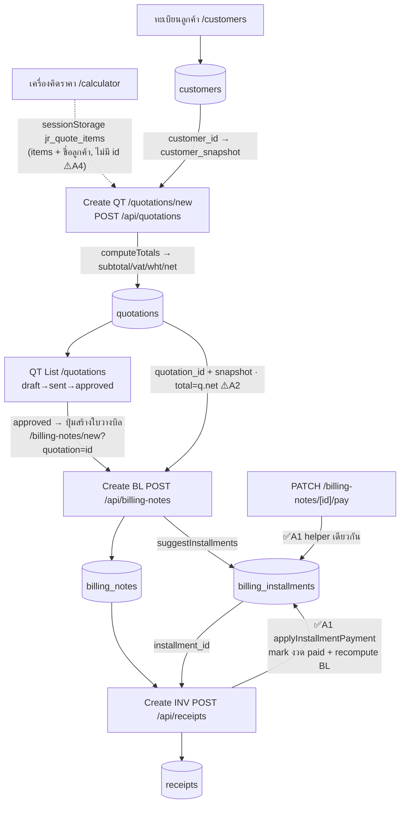

# DATA_FLOW.md — Chain เอกสารการเงิน JR Beta

> ทุกตาราง/FK/RPC = **EXISTS** ยกเว้นที่ทำเครื่องหมาย NEW/REFACTOR

## 1) Chain

## 2) Schema / FK — EXISTS vs REFACTOR
| ความเชื่อม | Field / FK | สถานะ |
|---|---|---|
| customer → QT | `quotations.customer_id` + `customer_snapshot` jsonb | EXISTS |
| ราคา calc → QT | `sessionStorage["jr_quote_items"]` (client bridge) | EXISTS |
| tax QT | `vat_rate/discount_pct/wht_rate` + `subtotal/vat_amt/total/wht_amt/net` | EXISTS (money.ts) |
| QT → BL | `billing_notes.quotation_id` + snapshot copy | EXISTS |
| BL → งวด | `billing_installments.billing_note_id` (CASCADE) | EXISTS |
| BL → INV | `receipts.billing_note_id` | EXISTS |
| งวด → INV | `receipts.installment_id` | EXISTS |
| รหัสเอกสาร | `document_sequences` + RPC `next_document_code` | EXISTS (atomic, reset เดือน) |
| **INV → mark งวด paid + recompute BL** | `lib/billing.ts:applyInstallmentPayment` (reuse field เดิม) | ✅ **REFACTOR A1 (เสร็จ)** |
| carry subtotal/vat_rate QT→BL | join `quotation_id` (no migration) | 📋 A2 (planned) |

**สรุป:** chain หลักไม่ต้องสร้างตารางใหม่ · A1 แก้ด้วย helper (reuse field เดิม ไม่มี field ใหม่)

## 3) Auto carry-forward
- **QT:** route ดึง `customers` → snapshot · `computeTotals` server-side = source of truth
- **BL:** verify `q.status='approved'` → copy snapshot, `total=q.net` → `suggestInstallments` insert งวด `pending`
- **INV:** ดึง `bn.customer_snapshot` → copy + `billing_note_id`/`installment_id` → ✅ **A1: ปิดงวด + recompute BL**
- **รหัส:** ทุก POST เรียก RPC `next_document_code` (atomic, reset รายเดือน)
